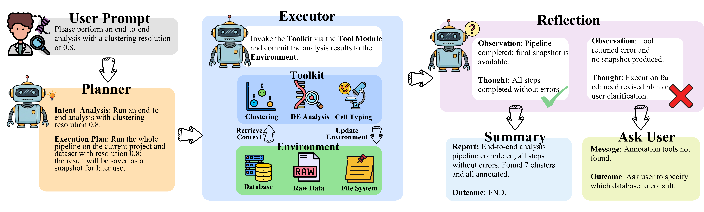

 Gardener Biological Agent

> An AI-driven biological analysis engine for privacy-preserving, expert-steered single-cell RNA sequencing (scRNA-seq).

**News:** *Gardener Biological Agent Beta 1.0.0* is here — we're opening it up for internal testing. We plan to move this to HPC node. Try it and tell us what you think!

## What is Gardener?

Gardener is an interactive AI co-pilot designed specifically for scRNA-seq analysis. It bridges the gap between the advanced reasoning of cloud-hosted Large Language Models (LLMs) and the strict data residency requirements of biomedical research.

Unlike existing cloud-centric LLM agents, Gardener ensures that **your sensitive expression matrices never leave your local device**.

---
## Key Features

* **Complete Data Privacy (Resident State Protocol):**  
  Gardener operates using a unique architecture where cloud LLMs only see coordinate references and sanitized metadata. All raw expression data and large artifacts remain strictly on your local machine.

* **Immutable Experiment Lineage:**  
  Powered by our Experiment Management Kernel (EMK), every analysis step is saved as a persistent, versioned snapshot. This enables effortless rollback, branching, and comparison of alternative analysis paths.

* **ReAct-Style Autonomous Agent:**  
  Simply use natural language to orchestrate complex workflows. Gardener handles planning, tool invocation (QC, HVG, clustering, annotation, DGE), and memory management.

* **Human-in-the-Loop Steering:**  
  A rich local Graphical User Interface (GUI) provides real-time visualization of outputs (such as UMAPs and DotPlots). You retain full control to steer the analysis, refine clusters, and validate biological findings before proceeding.
---
## How it Works

1. **Interact:**  
   Provide high-level instructions via the Chat Panel.

2. **Plan:**  
   The Perception-and-Planning module interprets your intent and formulates a step-by-step execution plan.

3. **Execute:**  
   The Local Scientific Engine runs the required bioinformatic tools entirely on-device.

4. **Review:**  
   Inspect the generated artifacts (UMAPs, marker genes, cell types) in the Analysis Inspector and adjust as needed.
